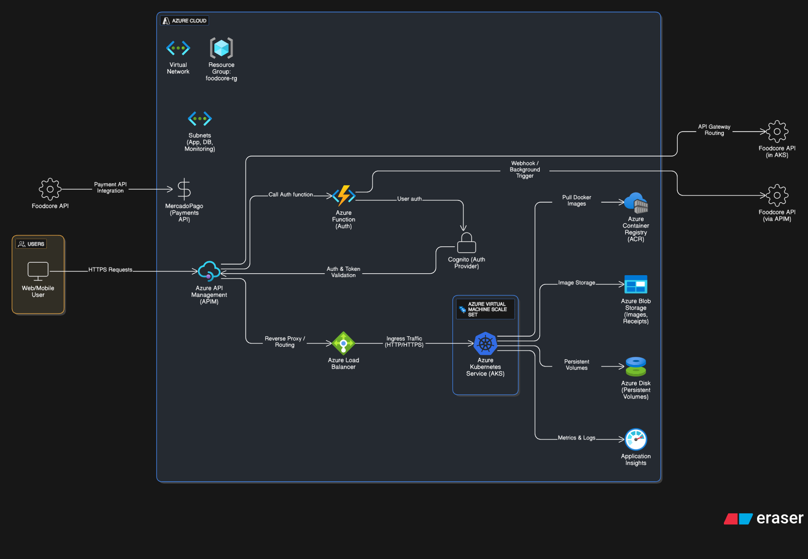
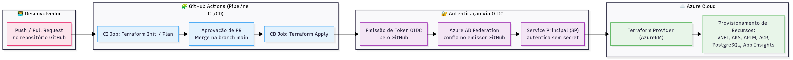

# 🏗️ Food Core Infra

Infraestrutura do projeto para gerenciar pedidos de restaurantes fast-food, desenvolvida como parte do curso de Arquitetura de Software
da FIAP (Tech Challenge).

<div align="center">
  <a href="#visao-geral">Visão Geral</a> •
  <a href="#tecnologias">Tecnologias</a> •
  <a href="#recursos-provisionados">Recursos provisionados</a> •
  <a href="#trafego-e-segurança">Tráfego e Segurança</a> •
  <a href="#localizacao">Localização</a> •
  <a href="#Performance">Performance</a> •
  <a href="#setup-do-tenant-e-service-principal">Setup do Tenant e Service Principal</a> •
  <a href="#fluxo-de-deploy">Fluxo de Deploy</a> •
  <a href="#boas-praticas">Boas Práticas</a>
</div><br>

> 📽️ Vídeo de demonstração da arquitetura: [https://www.youtube.com/watch?v=soaATSbSRPc](https://www.youtube.com/watch?v=XgUpOKJjqak)<br>

# ☁️ Infraestrutura (Azure)

## 📖 Visão Geral

Este repositório contém os **scripts de IaC (Terraform)** responsáveis por provisionar toda a infraestrutura do projeto.

## 🚀 Tecnologias

- **Terraform**
- **Azure Cloud**
- **AWS Cloud**
- **GitHub Actions** para CI/CD

### Recursos provisionados

- **Resource Group**
- **Virtual Network (VNET)** com subnets delegadas e zona de DNS privada
- **AKS (Azure Kubernetes Service)** Somente o Cluster
- **APIM (Azure API Management)**
- **Azure Function**
- **Azure Blob**
- **AWS Cognito**
- **ACR (Azure Container Registry)**
- **Application Insights**

> ⚠️ Nenhum recurso Kubernetes (deployments, services, ingress etc.) é criado por este repositório, apenas o **cluster AKS** em si.

> ⚠️ Este repositório não faz o deploy da **Azure function** de autenticação. Ele somente cria alguns recursos que serão utilizados por ela.

### Tráfego e Segurança

- Todo tráfego entre serviços é **privado**:
  - AKS → APIM
  - Azure Function → APIM
  - Azure PostgreSQL Flexible Server → AKS
- Nenhum desses recursos recebe tráfego inbound público.
- Todo acesso ao **AKS** e à **Azure Function** é intermediado via **APIM**.

### Localização

- Todos os recursos foram criados na região **Brazil South** para reduzir latência.
- **Exceção:** o **Cognito**, que por limitações da AWS Academy foi criado no **East US**.
  - Isso aumentou a latência das chamadas à Azure Function, já que ela é invocada como **sub-request em toda requisição ao backend**.
  - Para mitigar, foi configurado **caching no Produto da API no APIM**.

### Performance

- A **Azure Function** foi configurada com **Always On**, reduzindo o problema de **cold start**.
- Todas as requisições estão sob **caching no Produto da API no APIM**.

## 🔧 Setup do Tenant e Service Principal

Antes de executar as pipelines de infraestrutura, é necessário configurar o tenant do Azure e criar o **Service Principal** com permissão para o Terraform aplicar as mudanças.

### 1️⃣ Criar Service Principal

Execute o comando abaixo no Azure CLI substituindo `subscription_id` pelo ID da sua assinatura:

```bash
az ad sp create-for-rbac --name "sp-soat-team8-tc3" --role contributor --scopes /subscriptions/<subscription_id>
```

Exemplo de saída:

```json
{
  "clientId": "seu-client-id",
  "clientSecret": "sua-secret-hash",
  "subscriptionId": "sua-subscription",
  "tenantId": "11dbbfe2-89b8-4549-be10-cec364e59551",
  "activeDirectoryEndpointUrl": "https://login.microsoftonline.com",
  "resourceManagerEndpointUrl": "https://management.azure.com/",
  "activeDirectoryGraphResourceId": "https://graph.windows.net/",
  "sqlManagementEndpointUrl": "https://management.core.windows.net:8443/",
  "galleryEndpointUrl": "https://gallery.azure.com/",
  "managementEndpointUrl": "https://management.core.windows.net/"
}
```

### 2️⃣ Criar Federação (OIDC)

Para que o Azure confie nos tokens OIDC emitidos pelo GitHub Actions, crie um arquivo cred.json com o seguinte conteúdo:

```json
{
  "name": "githubaction-sp-soat-team8-tc3",
  "issuer": "https://token.actions.githubusercontent.com",
  "subject": "repo:organization/repo_name:ref:refs/heads/master",
  "audiences": ["api://AzureADTokenExchange"]
}
```

Depois, execute o comando abaixo substituindo **<service_principal_clientId>**:

```bash
az ad app federated-credential create --id <service_principal_clientId> --parameters cred.json
```

Isso permitirá que o pipeline do GitHub se autentique no Azure sem precisar armazenar client secret diretamente.

### 3️⃣ Conceder Permissões Adicionais

Conceda ao Service Principal permissão para atribuir roles (necessário para vínculo AKS ↔ ACR e AKS ↔ Subnet):

```bash
az role assignment create \
  --assignee <service_principal_clientId> \
  --role "User Access Administrator" \
  --scope /subscriptions/<subscription_id>
```

## ⚙️ Fluxo de Deploy

1. Alterações de infraestrutura são feitas via **Pull Request**.
2. **Terraform Plan** roda automaticamente no pipeline.
3. Após aprovação, **Terraform Apply** executa no merge.
4. Infraestrutura é provisionada/atualizada automaticamente.

Ao finalizar o deploy, será provisionado uma estrutura semelhante a essa



### Fluxo CI/CD



## 🔒 Boas Práticas

- Uso de **Secrets do GitHub** para dados sensíveis.
- Branch `main` protegida (merge apenas via Pull Request).
- Toda alteração na cloud é feita via **Terraform**, garantindo rastreabilidade.
