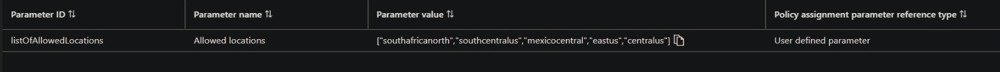

# 🏗️ FoodCore Infra

<div align="center">

Infraestrutura base do projeto FoodCore, provisionando recursos fundamentais na Azure e AWS. Desenvolvida como parte do curso de Arquitetura de Software da FIAP (Tech Challenge).

</div>

<div align="center">
  <a href="#visao-geral">Visão Geral</a> •
  <a href="#recursos-provisionados">Recursos Provisionados</a> •
  <a href="#tecnologias">Tecnologias</a> •
  <a href="#arquitetura">Arquitetura</a> •
  <a href="#setup">Setup do Tenant</a> •
  <a href="#deploy">Fluxo de Deploy</a> •
  <a href="#instalacao-e-uso">Instalação e Uso</a> •
  <a href="#debitos-tecnicos">Débitos Técnicos</a> •
  <a href="#contribuicao">Contribuição</a>
</div><br>

> 📽️ Vídeo de demonstração da arquitetura: [https://youtu.be/k3XbPRxmjCw](https://youtu.be/k3XbPRxmjCw)<br>

---

<h2 id="visao-geral">📋 Visão Geral</h2>

Este repositório contém os **scripts de IaC (Terraform)** responsáveis por provisionar toda a infraestrutura base do projeto FoodCore.

### Responsabilidades

- **Networking**: VNET, Subnets, DNS privado
- **Compute**: AKS (cluster Kubernetes)
- **Gateway**: APIM, Application Gateway
- **Storage**: Azure Blob, ACR
- **Security**: Key Vault, Cognito
- **Observability**: Application Insights

> ⚠️ Este repositório **não** provisiona recursos Kubernetes (Deployments, Services, Ingress). Apenas o cluster AKS em si.

---

<h2 id="recursos-provisionados">📦 Recursos Provisionados</h2>

| Recurso                    | Descrição                                                       |
| -------------------------- | --------------------------------------------------------------- |
| **Resource Group**         | Agrupamento lógico de recursos                                  |
| **Virtual Network (VNET)** | Rede virtual com subnets delegadas e DNS privado                |
| **Public IP**              | IP público para Ingress do AKS                                  |
| **Application Gateway**    | Load balancer L7 e WAF (usado como Ingress Controller)          |
| **AKS**                    | Azure Kubernetes Service (cluster)                              |
| **APIM**                   | Azure API Management (API Gateway)                              |
| **Azure Function**         | Recursos base para função de autenticação                       |
| **Azure Service Bus**      | Message broker para comunicação assíncrona entre microsserviços |
| **Azure Blob Storage**     | Armazenamento de imagens de produtos                            |
| **ACR**                    | Azure Container Registry para imagens Docker                    |
| **Application Insights**   | Monitoramento e telemetria de aplicações                        |
| **Key Vault**              | Gerenciamento seguro de secrets e credenciais                   |
| **AWS Cognito**            | Gerenciamento de identidade e autenticação                      |

---

<h2 id="tecnologias">🔧 Tecnologias</h2>

| Categoria              | Tecnologia     |
| ---------------------- | -------------- |
| **IaC**                | Terraform      |
| **Cloud**              | Azure, AWS     |
| **CI/CD**              | GitHub Actions |
| **Container Registry** | ACR            |

---

<h2 id="arquitetura">🧱 Arquitetura</h2>

<details>
<summary>Expandir para mais detalhes</summary>

### Tráfego e Segurança

- Todo tráfego entre serviços é **privado**:
  - AKS → APIM (privado)
  - Azure Function → APIM (privado)
  - PostgreSQL → AKS (privado)
- Acesso ao AKS e Azure Function intermediado via **APIM**

### Localização

- Recursos criados na região **Brazil South** (baixa latência)
- **Exceção**: Cognito em **East US** (limitação AWS Academy)
  - Mitigação: Caching no APIM

### Performance

- **Azure Function**: Always On (reduz cold start)
- **APIM**: Caching habilitado para reduzir latência

### Repositórios do Ecossistema

| Repositório | Responsabilidade |
|-------------|------------------|
| **[foodcore-infra](https://github.com/FIAP-SOAT-TECH-TEAM/foodcore-infra)** | Infraestrutura base (este repositório) |
| **[foodcore-db](https://github.com/FIAP-SOAT-TECH-TEAM/foodcore-db)** | Bancos de dados |
| **[foodcore-auth](https://github.com/FIAP-SOAT-TECH-TEAM/foodcore-auth)** | Azure Function de auth |
| **[foodcore-observability](https://github.com/FIAP-SOAT-TECH-TEAM/foodcore-observability)** | Stack de observabilidade |
| **[foodcore-order](https://github.com/FIAP-SOAT-TECH-TEAM/foodcore-order)** | Microsserviço de pedidos |
| **[foodcore-payment](https://github.com/FIAP-SOAT-TECH-TEAM/foodcore-payment)** | Microsserviço de pagamentos |
| **[foodcore-catalog](https://github.com/FIAP-SOAT-TECH-TEAM/foodcore-catalog)** | Microsserviço de catálogo |

</details>

---

<h2 id="setup">⚙️ Setup do Tenant e Service Principal</h2>

<details>
<summary>Expandir para mais detalhes</summary>

### 1️⃣ Criar Service Principal

```bash
az ad sp create-for-rbac \
  --name "sp-soat-team8-tc3" \
  --role contributor \
  --scopes /subscriptions/<subscription_id>
```

### 2️⃣ Criar Federação OIDC

Crie arquivo `cred.json`:

```json
{
  "name": "githubaction-sp-soat-team8-tc3",
  "issuer": "https://token.actions.githubusercontent.com",
  "subject": "repo:organization/repo_name:ref:refs/heads/master",
  "audiences": ["api://AzureADTokenExchange"]
}
```

Execute:

```bash
az ad app federated-credential create \
  --id <service_principal_clientId> \
  --parameters cred.json
```

### 3️⃣ Conceder Permissões

```bash
az role assignment create \
  --assignee <service_principal_clientId> \
  --role "User Access Administrator" \
  --scope /subscriptions/<subscription_id>

az role assignment create \
  --assignee <service_principal_clientId> \
  --role "Contributor" \
  --scope /subscriptions/<subscription_id>

az role assignment create
--assignee <service_principal_clientId> \
--role "Key Vault Secrets Officer" \
--scope /subscriptions/<subscription_id>
```

</details>

---

<h2 id="deploy">⚙️ Fluxo de Deploy</h2>

<details>
<summary>Expandir para mais detalhes</summary>

### Pipeline

1. **Pull Request**
   - Preencher template de pull request adequadamente

2. **Revisão e Aprovação**
   - Mínimo 1 aprovação de CODEOWNER

3. **Merge para Main**

### Proteções

- Branch `main` protegida
- Nenhum push direto permitido
- Todos os checks devem passar

### Ordem de Provisionamento

```
1. foodcore-infra        (AKS, VNET)
2. foodcore-db           (Bancos de dados)
3. foodcore-auth           (Azure Function Authorizer)
4. foodcore-observability (Serviços de Observabilidade)
5. foodcore-order            (Microsserviço de pedido)
6. foodcore-payment            (Microsserviço de pagamento)
7. foodcore-catalog            (Microsserviço de catálogo)
```

> ⚠️ Opcionalmente, as pipelines do repositório `foodcore-shared` podem ser executadas para publicação de um novo package. Atualizar os microsserviços para utilazarem a nova versão do pacote.

</details>

---

<h2 id="instalacao-e-uso">🚀 Instalação e Uso</h2>

### Desenvolvimento Local

```bash
# Clonar repositório
git clone https://github.com/FIAP-SOAT-TECH-TEAM/foodcore-infra.git
cd foodcore-infra/terraform

# Configurar variáveis de ambiente (Docker)
cp docker/env-example docker/.env

# Subir dependências
./food start:infra
```

> ⚠️ Use o utilitário de linha de comandos `dos2unix` para corrigir problemas de CLRF e LF.
> Ajuste os arquivos .env conforme necessário.

---

<h2 id="debitos-tecnicos">⚠️ Débitos Técnicos</h2>

<details>
<summary>Expandir para mais detalhes</summary>

| Débito | Descrição | Impacto |
|--------|-----------|---------|
| **WAF Layer** | Implementar camada WAF antes do API Gateway para proteção OWASP TOP 10 | Segurança crítica |
| **Workload Identity** | Usar Workload Identity para que Pods acessem recursos Azure (atual: Azure Key Vault Provider) | Segurança e gestão de credenciais |
| **Azure Service Bus SKU** | Migrar para SKU Premium para habilitar Private Endpoint | Segurança de rede |
| **Redundância Regional** | Habilitar redundância regional completa | Alta disponibilidade |

### 💡 Observações sobre Custos

> Alguns recursos foram implementados com downgrade ou comentados devido ao alto custo ou limitações da assinatura Azure For Students/AWS Academy:
>
> - **Azure Service Bus**: Private Endpoint apenas disponível com SKU Premium (custo elevado)
> - **AKS**: Node pools reduzidos para economia de créditos
> - **HA/ZRS**: Desabilitado por limitações de assinatura
>
> A infraestrutura ideal foi implementada, com alguns trechos comentados para viabilizar o desenvolvimento sem esgotar créditos.

## Regiões Permitidas
>
> A assinatura **Azure For Students** impõe restrições de Policy que limitam a criação de recursos às seguintes regiões:
>
> 

</details>

---

<h2 id="contribuicao">🤝 Contribuição</h2>

### Fluxo de Contribuição

1. Crie uma branch a partir de `main`
2. Implemente suas alterações
3. Abra um Pull Request
4. Aguarde aprovação de um CODEOWNER

### Licença

Este projeto está licenciado sob a [MIT License](LICENSE).

---

<div align="center">
  <strong>FIAP - Pós-graduação em Arquitetura de Software</strong><br>
  Tech Challenge 4
</div>
